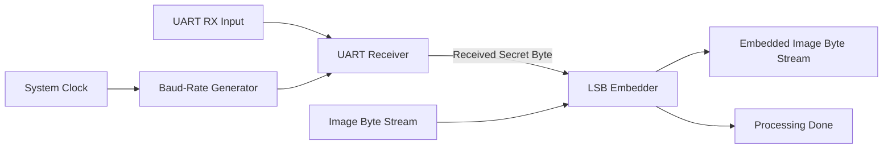

# UART-Based Image Steganography in Verilog

A digital hardware implementation of **image steganography using UART communication and Least Significant Bit (LSB) embedding**, written in Verilog.

The system receives a secret text message through a UART interface and embeds the message bit-by-bit into the least significant bits of an RGB image byte stream.

The project combines **digital communication**, **finite-state-machine design**, and **streaming data processing** in an FPGA-oriented HDL implementation.

---

## Overview

The design consists of three main stages:

1. **UART Baud-Rate Generation**  
   Generates a clock-enable signal for oversampling the asynchronous UART input.

2. **UART Reception**  
   Receives the secret message byte-by-byte using a finite-state machine and 16× oversampling.

3. **LSB Steganography**  
   Replaces the least significant bit of consecutive image bytes with bits from the received message.

Each 8-bit character therefore requires **8 image bytes** for embedding.

The current implementation uses the ASCII character `.` as the end-of-message delimiter.

---

## Architecture



The top-level module connects the UART receiver, baud-rate generator, and LSB embedding engine into a single streaming datapath.

---

## UART Receiver

The UART receiver is implemented as a finite-state machine with the following states:

```text
IDLE
  ↓
START BIT
  ↓
DATA BITS
  ↓
STOP BIT
  ↓
IDLE
```

The receiver:

- detects the UART start bit,
- samples incoming data using **16× oversampling**,
- reconstructs an 8-bit UART character,
- generates a `ready` pulse when a complete byte has been received.

Default UART configuration:

| Parameter | Value |
|---|---:|
| System clock | 50 MHz |
| Baud rate | 9600 baud |
| Oversampling | 16× |
| Data bits | 8 |

The clock and baud-rate parameters can be changed in the Verilog modules.

---

## LSB Embedding

For every secret-message byte received through UART:

```text
Secret byte
    ↓
b0 b1 b2 b3 b4 b5 b6 b7
    ↓
8 consecutive image bytes
```

Each secret bit replaces the least significant bit of one image byte:

```text
Original image byte:

b7 b6 b5 b4 b3 b2 b1 b0
                     ↑
                    LSB

Embedded byte:

b7 b6 b5 b4 b3 b2 b1 secret_bit
```

Only one bit of each image byte is modified, keeping the numerical change to each modified byte minimal.

The hardware operation is effectively:

```verilog
image_byte_out <= {image_byte_in[7:1], secret_bit};
```

---

## Example

Suppose the secret character is:

```text
'A' = 0x41 = 01000001
```

The eight bits of the character are embedded into the LSBs of eight consecutive image bytes.

Conceptually:

```text
Image byte 0 → LSB replaced with message bit 0
Image byte 1 → LSB replaced with message bit 1
Image byte 2 → LSB replaced with message bit 2
...
Image byte 7 → LSB replaced with message bit 7
```

The resulting byte stream represents the steganographic image.

---

## Repository Structure

```text
uart-image-steganography/
│
├── baudrate.v
│   └── UART baud-rate / oversampling clock-enable generator
│
├── uart_rx.v
│   └── UART receiver implemented using an FSM
│
├── lsb_algorithm2.v
│   └── LSB message embedding logic
│
├── top.v
│   └── Top-level integration of UART and steganography modules
│
└── Image_Binary converter/
    └── Utilities for image/binary data conversion
```

---

## Top-Level Interface

The top-level design accepts:

### Secret-data interface

```text
uart_rx
```

Serial UART input carrying the secret message.

### Image interface

```text
image_byte_in
image_byte_valid
```

Streaming input containing the image bytes.

### Output interface

```text
embedded_byte_out
processing_done
```

The modified image byte stream and a signal indicating that embedding has completed.

Additional debug outputs expose the decoded UART data and the number of image bytes processed.

---

## Configurable Parameters

The design can be configured through Verilog parameters.

### Image parameters

```verilog
IMG_WIDTH
IMG_HEIGHT
BYTES_PER_PIXEL
```

Default configuration:

```text
100 × 100 RGB image
3 bytes per pixel
```

Therefore:

```text
TOTAL_BYTES = 100 × 100 × 3 = 30,000 bytes
```

### Communication parameters

```verilog
clk_freq
baud_rate
```

Default configuration:

```text
clk_freq  = 50 MHz
baud_rate = 9600
```

---

## Data Flow

The complete processing pipeline is:

```text
Secret Text
    │
    ▼
UART Serial Transmission
    │
    ▼
16× Oversampled UART Receiver
    │
    ▼
8-bit Secret Character
    │
    ▼
Bit-by-Bit LSB Embedding
    ▲
    │
RGB Image Byte Stream
    │
    ▼
Modified Image Byte Stream
    │
    ▼
Steganographic Image
```

---

## Design Concepts Demonstrated

This project demonstrates several digital-design concepts:

- RTL design using **Verilog**
- UART serial communication
- Baud-rate generation
- 16× UART oversampling
- Finite-state-machine design
- Serial-to-parallel data reception
- Parameterized hardware modules
- Streaming byte-level processing
- Image-data manipulation
- LSB steganography
- Hierarchical RTL integration

---

## Implementation Notes

The current implementation:

- receives the hidden message through UART,
- processes RGB image data as a byte stream,
- embeds one secret bit per image byte,
- uses `.` (`0x2E`) as the end-of-message marker,
- exposes internal signals for debugging and simulation.

The design focuses on the **embedding datapath**. Reconstructing the final image file from the resulting byte stream is handled externally.

LSB steganography should also not be confused with encryption: the goal is to conceal the presence of the message inside image data rather than cryptographically protect its contents.

---

## Possible Extensions

Possible future improvements include:

- FIFO buffering between the UART receiver and embedding engine
- configurable end-of-message framing instead of a fixed delimiter
- message-length headers
- UART transmitter support
- hardware LSB extraction/decoding
- higher baud rates
- image-memory or BRAM integration
- FPGA board deployment
- automated testbenches
- integrity checking or CRC
- cryptographic preprocessing of the secret message

---

## Technologies

- **Verilog HDL**
- **UART**
- **Digital Logic / FSM Design**
- **Image Steganography**
- **LSB Encoding**
- **FPGA-oriented RTL Design**

---

## Author

**Saina S.**

Electrical Engineering project exploring the integration of digital communication and hardware-based image processing.
